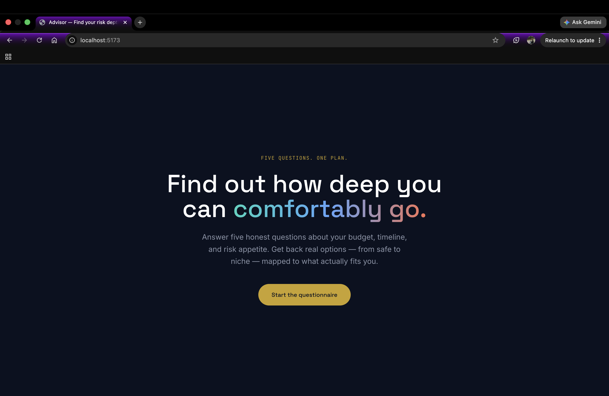
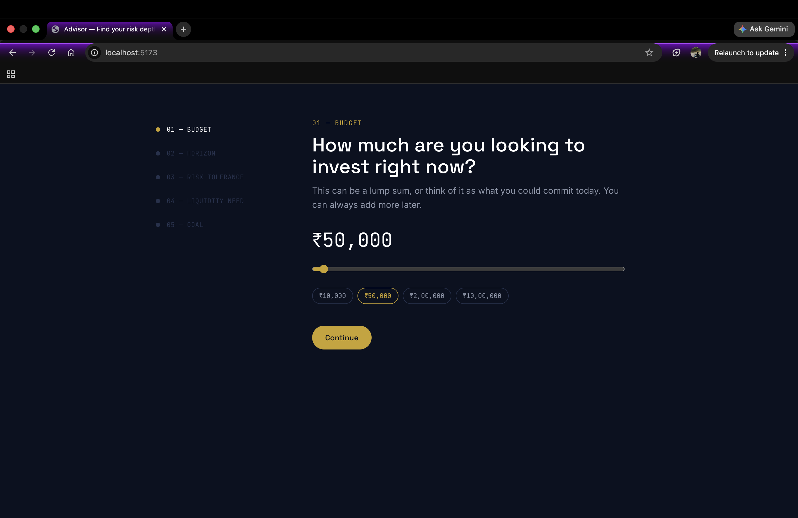

<h1 align="center">💰 Investment Advisor Bot</h1>

<p align="center">
An AI-assisted investment recommendation platform that converts a simple 5-question assessment into personalized investment strategies.
</p>

<p align="center">
Assess Risk • Match Investments • Generate AI Explanations • Make Better Financial Decisions
</p>

<p align="center">


</p>

---

# 🎥 Demo

> **Demo Video:** *(Add YouTube or Loom link here)*

> **Live Preview:** *(Add deployment link here)*



---

# 🚀 Why Investment Advisor Bot?

Most beginner investors struggle to choose investments that align with their financial goals and risk tolerance.

Investment Advisor Bot simplifies this process through a guided questionnaire. Instead of relying entirely on AI, the platform uses a deterministic rule-based recommendation engine to generate transparent, explainable investment suggestions, while Gemini AI provides personalized explanations in natural language.

This approach ensures recommendations remain consistent, auditable, and reliable.

---

# ✨ Highlights

- 📊 Rule-based risk assessment engine
- 🤖 AI-generated investment explanations
- 💼 Personalized investment portfolios
- 📈 Three recommendation tiers
- ⚡ Fast React + Express architecture
- 🔒 Deterministic recommendation logic
- 🧠 Explainable AI responses
- 📱 Responsive user interface

---

# 📌 Features

| Feature | Status |
|----------|--------|
| Five-Step Questionnaire | ✅ |
| Risk Profile Generation | ✅ |
| Investment Matching Engine | ✅ |
| Safe Portfolio | ✅ |
| Balanced Portfolio | ✅ |
| Aggressive Portfolio | ✅ |
| Gemini AI Explanations | ✅ |
| Offline Fallback Explanations | ✅ |

---

# 🏗 Architecture

```text
             User
              │
              ▼
      React Frontend
              │
              ▼
      Express API Server
              │
              ▼
      Risk Scoring Engine
              │
              ▼
   Instrument Matching Engine
              │
              ▼
 Curated Investment Dataset
              │
              ▼
 Gemini Explanation Generator
              │
              ▼
 Personalized Recommendations
```

Detailed architecture and product specification are available in **docs/PRODUCT_SPEC.md**.

---

# 📷 Application Preview

### Landing Page


### Questionnaire




---

# ⚙ Tech Stack

## Frontend

- React
- TypeScript
- Vite
- Tailwind CSS

## Backend

- Node.js
- Express.js
- TypeScript

## AI

- Gemini API

## Data

- Curated JSON Instrument Database

---

# 🧠 Recommendation Pipeline

```text
User Answers
      │
      ▼
Risk Score Calculation
      │
      ▼
Instrument Matching
      │
      ▼
Generate Safe Portfolio
Generate Balanced Portfolio
Generate Aggressive Portfolio
      │
      ▼
Gemini AI Explanation
      │
      ▼
Final Recommendations
```

---

# 📂 Project Structure

```text
financial-advisor-bot/

├── backend/
│   ├── controllers/
│   ├── services/
│   ├── routes/
│   ├── middleware/
│   ├── models/
│   ├── config/
│   └── data/

├── frontend/
│   ├── components/
│   ├── pages/
│   ├── hooks/
│   ├── context/
│   ├── services/
│   └── types/

└── docs/
```

---

# 🚀 Getting Started

Clone the repository

```bash
git clone https://github.com/Zoro-1012/investment-advisor-bot.git

cd investment-advisor-bot
```

---

## Backend

```bash
cd backend

npm install

cp .env.example .env

npm run dev
```

Backend runs at

```
http://localhost:4000
```

---

## Frontend

```bash
cd frontend

npm install

cp .env.example .env

npm run dev
```

Frontend runs at

```
http://localhost:5173
```

---

# 🔑 Environment Variables

```env
GEMINI_API_KEY=YOUR_API_KEY
```

---

# 🔄 Recommendation Flow

1. User answers five financial questions.
2. Risk tolerance is calculated.
3. Investment instruments are matched using deterministic rules.
4. Three investment portfolios are generated.
5. Gemini AI creates personalized explanations.
6. Fallback templates are used if Gemini is unavailable.
7. Final recommendations are displayed.

---

# 📈 Recommendation Categories

### 🟢 Safe

Low-risk investments for capital preservation.

### 🟡 Balanced

Moderate risk with balanced growth.

### 🔴 Aggressive

High-risk investments with higher return potential.

---

# 🎯 Design Philosophy

Unlike many AI financial assistants, Investment Advisor Bot does **not** rely on an LLM to make investment decisions.

Instead:

- Recommendation logic is deterministic and explainable.
- AI is responsible only for natural-language explanations.
- The recommendation engine remains fully functional even if Gemini is unavailable.

This architecture improves reliability, transparency, and auditability.

---

# 🚀 Roadmap

Future improvements include:

- User authentication
- Portfolio history
- Live stock & ETF APIs
- Mutual fund integrations
- Portfolio comparison
- Goal tracking
- Tax optimization
- Investment simulations

---

# 🤝 Contributing

Contributions, ideas, and feature requests are welcome.

Please open an Issue or Pull Request.

---

# ⭐ Support

If you found this project useful, please consider giving it a **Star ⭐**.
